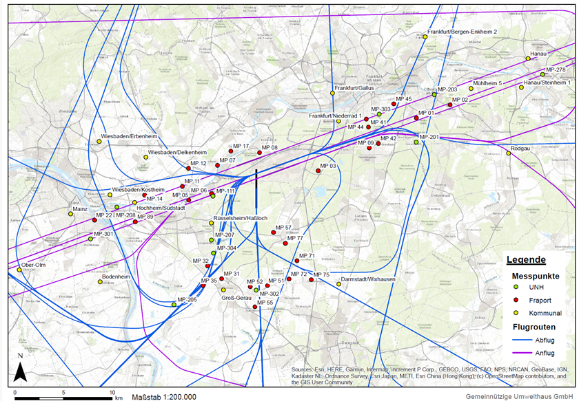

```{r setup, include=FALSE}
rm(list = ls())
#update.packages(ask = FALSE)
# Laden der für das Dokument benötigten Pakete
library(knitr)
library(stringr)
library(kableExtra)
library(pander)
library(dplyr)
library(readr)
library(plotly)
library(flextable)
library(tidyr)
library(pdftools)
library(rsvg)
library(cachem)
library(fastmap)
library(scales)


# Setzen von globalen Chunkoptionen, jeder Chunk gibt per default nicht den Code aus, keine R messages und auch keine R warnings
knitr::opts_chunk$set(echo = FALSE, 
                      message = FALSE,
                      warning = FALSE,
                      fig.align = "left")
```

```{r equationFunctions, cache=TRUE, include=FALSE}
# Definition von R Funktionen die zur Nummerierung von R Funktionen im Dokument verwendet werden.

is_docx_output <- function (fmt = knitr:::pandoc_to()) {
  if (length(fmt) == 0) {
    return(FALSE)
  } else {
    return(fmt == "docx")
  }
}
numberEq.docx <- function (eq, lab, envir = docx.eqcounter) {
  assign(x = "counter", value = get(x = "counter", envir = envir)+1, envir = envir)
  assign(x = gsub("eq:", "", lab), value = get(x = "counter", envir = envir), envir = envir)
  lab <- get("counter", envir = envir)
  return(paste0('$$', eq, '\\;\\;\\;\\;(', lab, ')', '$$'))
}

labEq.docx <- function (lab, envir = docx.eqcounter) {
  return(paste0('(', get(x = gsub("eq:", "", lab), envir = envir), ')'))
}

docx.eqcounter <- new.env()
docx.eqcounter$counter <- 0
docx.eqcounter$binomial

```

```{r imageFunctions, cache=TRUE, include=FALSE}
# Defintion von R Funktionen die bei der Einbindung von svg und pdf Bildern unterstützen.

get_image_info <- function(path, type = "svg") {
  
  if (!type %in% c("svg", "pdf")) stop("type needs to be a svg or pdf")
  
  if (type == "svg") {
    info <- magick::image_read_svg(path) %>% 
      magick::image_info()
  }
  
  if (type == "pdf") {
    info <- magick::image_read_pdf(path) %>% 
      magick::image_info()
  }
  
  density <- info %>% 
    dplyr::pull(density) %>% 
    strsplit("x") %>% 
    unlist() %>% 
    head(1) %>% 
    as.numeric()
  
  width <- info$width/density
  height <- info$height/density
  
  return(list(
    density = density,
    width = width,
    height = height
  ))
}

```

```{r AnalyseSetup, include=FALSE}

# Laden der speziell für die Analyse benötigten zusätzlichen Pakete
library(lubridate)
library(directlabels)
library(VennDiagram)
library(readxl)


```

```{r logo, eval=FALSE, fig.align='center', include=FALSE}
# Einbinden des Logos HLNUG auf das Deckblatt

```

```{=html}
<!--
manueller Seitenumbruch mit \newpage
-->
```
\newpage

```{=html}
<!--
Einfügen eines Inhaltsverzeichnis, die Schreibweise benötigt das Paket officedown, 
das Paket ermöglicht uns eine praktische Einbindung von Abbildungsverzeichnissen und Tabellenverzeichnissen, "seq_id: 'fig'" definiert das in das Verzeichnis Abbildungen eingetragen werden sollen, "seq_id: 'tab' das Tabellen eingetragen werden sollen
-->
```
[**Table of content**]{.underline}

<!---BLOCK_TOC--->

```{=html}
<!--
"##" für Überschrift Typ 2
-->
```
[**List of figures**]{.underline}

<!---BLOCK_TOC{seq_id: 'fig'}--->

\listoffigures

[**List of tables**]{.underline}

<!---BLOCK_TOC{seq_id: 'tab'}--->

\listoftables

\newpage

Diese Analyse wurde in RMarkdown geschrieben. Zum technischen Hintergrund siehe @xie2015.
Der Code der Analyse und die verwendeten Eingangsdaten wird unter dem öffentlich zugänglichen Repositorium  https://github.com/Ma-Loma/DFLD_Erfassungsraten.git versioniert.

# Ausgangsfrage

Welcher Einfluss hat der Fangradius und weitere Parameter auf die Erfassungsrate der DFLD-Messstationen.


# Einlesen der CSV-Dateien

Von den von Herrn Weise bereitgestellten Daten lese ich zunächst nur die mit von ihm präferierten Fangradien in R ein.

```{r read-csv-files}
# Pfad zum Datenordner
data_path <- "data"
#Daten mit von Herrn Weise präferierten Fangradien

#Daten mit von Herrn Weise präferierten Fangradien

# Liste aller CSV-Dateien im Datenordner
csv_files <- function(path) {
  list.files(path = path,
             pattern = "*.csv",
             full.names = TRUE)
}

csv_files(data_path)

# Funktion zum Einlesen einer einzelnen CSV-Datei
read_csv_file <- function(file) {
  col_names <- names(spec_delim(file, delim = ";")$cols)
  # Define col_types dynamically
  meine_Col_types <-
    cols(!!!setNames(lapply(col_names, function(col) {
      if (grepl("Nr", col) | grepl("Lfd", col)) {
        col_number()
      } else if (grepl("ts", col)|grepl("Zeit", col)) {
        col_time(format = "%H:%M:%S")
      } else {
        col_guess()
      }
    }),
    col_names))
  read_delim(
    file,
    delim = ";",
    escape_double = FALSE,
    col_types = meine_Col_types,
    #cols(StatNr = col_number(),Lfd = col_number(),`ts(anf)` = col_time(format = "%H:%M:%S"),`ts(end)` = col_time(format = "%H:%M:%S")),
    trim_ws = TRUE,
    locale = locale(encoding = 'ISO8859-1')#nötig, da sonst die Umlaute nicht gelesen werden können.
  )
}

# Einlesen der CSV-Dateien mit präferierten Fangradien und zusammenführen in einen Dataframe
meas_data <- function(pathlist) {
    lapply(pathlist, read_csv_file) %>%
    bind_rows() %>%
    mutate(check = `0`, .keep = "unused") %>%
    filter(check == 1)
}


praef_data <- csv_files(data_path) %>%
  .[!str_detect(., "full")] %>%
  meas_data(.) %>% 
  mutate(StatNam=str_remove(StatNam," ooo"))

full_data<-csv_files(data_path) %>%
  .[str_detect(., "ansi")] %>%
  meas_data(.) %>% 
  mutate(LasMax=`LasMax(Mss)`,StatNam=str_remove(StatNam," ooo"),.keep="unused")


```

In diesen Daten habe ich dann noch die Zeitdaten besser für R verarbeitbar gemacht.

```{r}
zeitstempeln <- function(data_in) {
  data_out <- data_in %>%
    mutate(
      AbAnDatetime = lubridate::as_datetime(dmy_hms(paste(
        AbAnDatum, AbAnZeit
      )),tz="Europe/Berlin"),
      tsAnfDatetime = lubridate::as_datetime(dmy_hms(paste(
        AbAnDatum, `ts(anf)`
      )),tz="Europe/Berlin"),
      tsEndDatetime = lubridate::as_datetime(dmy_hms(paste(
        AbAnDatum, `ts(end)`
      )),tz="Europe/Berlin"),
      .keep = "unused"
    ) %>%
    mutate(DEN = case_when(
      hour(tsAnfDatetime) %in% 6:17  ~ "D",
      # Day: 6 AM to 6 PM
      hour(tsAnfDatetime) %in% 18:21 ~ "E",
      # Evening: 6 PM to 10 PM
      TRUE ~ "N"                  # Night: 10 PM to 6 AM
    ))
  return(data_out)
}

praef_data<-zeitstempeln(praef_data)
full_data<-zeitstempeln(full_data)

praef_Fangradius<-praef_data %>% 
  select(StatNam,StatNr,Fangradius) %>% 
  unique()

Stationsliste<-full_data$StatNam %>% unique()

```


# Betrachtete Messstationen

Von den in Abb. \@ref(fig:MPKarte) dargestellten Messpunkten wurden die fünf DFLD Stationen ```r Stationsliste``` betrachet.


```{r MPKarte, fig.cap="Karte der Messpunkte", fig.width=6.7,fig.height=4}



```

Graphische Darstellung nach Fangradius in Abb. \@ref(fig:Scatterplots1), nach Analysemethode in Abb. \@ref(fig:Scatterplots2) und nach Messpegel in Abb. \@ref(fig:Scatterplots3).


```{r Scatterplots1, fig.cap="Graphische Darstellung der Daten mit präferiertem Fangradius", fig.width=6.7,fig.height=4}

praef_data %>% 
  ggplot(aes(x=AbAnDatetime,y=SEL,color=factor(Fangradius)))+
  geom_point()+
  facet_wrap(vars(StatNam))

```


```{r Scatterplots1f, fig.cap="Graphische Darstellung der Daten nach Fangradius. Der Teilgraph mit dem von Herrn Weise präferiertem Fangradius ist rot umrandet.", fig.width=6.7,fig.height=5.5}

full_data %>%
  filter(StatusNr == 0) %>%
  ggplot(aes(x = AbAnDatetime, y = SEL, color = factor(Typ))) +
  geom_point() +
  facet_grid(cols = vars(StatNam), rows = vars(Fangradius)) +
  geom_rect(
    data=praef_data,
    fill = NA,
    colour = "red",
    xmin = -Inf,
    xmax = Inf,
    ymin = -Inf,
    ymax = Inf
  )


```


```{r Scatterplots2, fig.cap="Graphische Darstellung der Daten mit präferiertem Fangradius nach gewählter Dauerschall-Analysemethode", fig.width=6.7,fig.height=4}

praef_data %>% 
  ggplot(aes(x=DEN,y=LasMax,fill=factor(Typ)))+
  geom_violin()+
  facet_wrap(vars(StatNam))

```


```{r Scatterplots3, fig.cap="Graphische Darstellung der Daten mit präferiertem Fangradius nach Schwelle", fig.width=6.7,fig.height=4}

praef_data %>% 
  ggplot(aes(x=DEN,y=LasMax,fill=factor(Typ)))+
  geom_violin()+
  facet_wrap(vars(StatNam))

```

# Formeln

## Dauerschallpegel

Der Dauerschalldruckpegel gemäß DIN 45643:2011 ist definiert als
$$
L_{p,A,eq,T} = 10\lg \left(\frac{t_0}{T}\sum_{I=1}^{N} 10^{L_{p,A,E,i}/10\,\textrm{dB}}\right)\,\textrm{dB}
$$
mit 
$$
L_{p,A,E,i}=10 \lg \left(\frac{1}{t_0}\int \frac{P_{A,i}(t)^2}{p_0^{\;2}}\right)\;(=\mathrm{SEL}).
$$
```{r Dauerschallpegel}

t0=as.duration(1)

dauerschallpegel <- function(SEL,T) {
  10*log10(t0/T * sum(10^(SEL/10),na.rm = T))
}

```

## Erfassungsdauern

Eine gewisse Herausforderung ist die korrekte Erfassung der Erfassungsdauern.

```{r Erfassungsdauern_Vorbereitung}
Erfassungsdauern<-
  full_data %>% 
  group_by(StatNam) %>%
  arrange(AbAnDatetime) %>%
  summarise(
    Anfang = first(AbAnDatetime),
    AnfangDatum = Anfang %>% date(),
    Ende = last(AbAnDatetime),
    EndeDatum = Ende %>% date(),
    Dauer = lubridate::interval(AnfangDatum, EndeDatum) %>%
      lubridate::as.duration()
  )

DENtafel <-  data.frame(
  ZeitLabel = c("D", "E", "N", "Tag"),
  Anfang = c("6:00:00", "18:00:00", "22:00:00", "6:00:00"),
  Periodenlaenge = c(hours(12), hours(4), hours(8), hours(16))
)

#seq(Erfassungsdauern$AnfangDatum %>% first(),Erfassungsdauern$EndeDatum %>% first(),by="day")
DENIntervalle <-
  function( Anfangsdatum, Endedatum) {
    DENtafel %>%
      crossing(Datum = seq(Anfangsdatum, Endedatum, by = "day") %>%
                 date()) %>%
      mutate(
        IntervallAnf = paste(Datum, Anfang) %>% lubridate::as_datetime(tz = "Europe/Berlin"),
        IntervallEnde = IntervallAnf + Periodenlaenge,
        Intervall = IntervallAnf %--% IntervallEnde
      )  %>%
      mutate(Dauer = Intervall / dseconds(1)) %>% # Das gibt die reale Dauer heraus; unterscheidet sich also bei Zeitumstellung.
      select(ZeitLabel,Datum, Intervall,Dauer)
  }


```


So ist beispielsweise die Dauer der Nacht bei Zeitumstellungen unterschiedlich:

```{r Illustration_Erfassungsdauer}
tableGerman<-set_flextable_defaults(decimal.mark = ",",big.mark=".")
#Bei Zeitumstellung ist die Dauer länger oder kürzer, Test hier
DENIntervalle(
    dmy("29.03.2025"),
    dmy("30.03.2025")) %>% 
  filter(ZeitLabel=="N") %>% 
  mutate(`Dauer [s]`=Dauer,.keep="unused") %>% 
  qflextable()

```


```{r }


eins <- Erfassungsdauern[[1, "AnfangDatum"]]
zwei <- Erfassungsdauern[[1, "EndeDatum"]]

DauernInIntervallen <- function(erstesDatum, zweitesDatum,label) {
  DENIntervalle(erstesDatum, zweitesDatum) %>%
    group_by(ZeitLabel) %>%
    summarise(Gesamtdauer = sum(Dauer)) %>%
    pivot_wider(names_from = ZeitLabel,values_from = Gesamtdauer) %>%
    mutate(StatNam=label)
}

DauernInIntervallenDF <- mapply(
  DauernInIntervallen,
  Erfassungsdauern$AnfangDatum,
  Erfassungsdauern$EndeDatum,
  Erfassungsdauern$StatNam
) %>% t %>%
  as.data.frame %>%
  mutate(
    StatNam = unlist(StatNam),
    D = unlist(D),
    E = unlist(E),
    N = unlist(N),
    Tag = unlist(Tag)
  ) %>% 
  pivot_longer(!StatNam,names_to = "DEN",values_to = "Dauer")

stat <-
  full_data %>%
  left_join(Erfassungsdauern) %>%
  mutate(Dauer=NULL) %>% 
  left_join(DauernInIntervallenDF) %>% 
  group_by(StatNam, Fangradius,DEN,WTC) %>%
  summarise(
    n1 = sum(StatusNr == 0),
    n2 = n(),
    Erfassungsquote = scales::percent(n1 / n2),
    Anfang = first(Anfang),
    Ende = first(Ende),
    Dauer = first(Dauer),
    Leq = dauerschallpegel(SEL, Dauer)
    )
stat<-praef_Fangradius %>%
  mutate(praef = Fangradius, .keep = "unused") %>%
  right_join(stat)


```


# Graphen

In Abb. \@ref(fig:Leq) ist der Dauerschallpegel aller Flieger als Funktion des Fangradius und nach Gewichtsklasse aufgeteilt dargestellt. Der von Herrn Weise präferierte Fangradius ist jeweils mit einer senkrechten Linie markiert.

```{r Leq, fig.cap="Graphische Darstellung des ermittelten Leq nach Gewichtsklasse.", fig.width=6.7,fig.height=4}
stat %>%
  ggplot(aes(x = Fangradius, y = Leq, color = DEN)) +
  geom_vline(aes(xintercept = praef), color = "black") +
  geom_line() +
  geom_point() +
  facet_grid(cols = vars(StatNam), rows = vars(WTC))


```

Erfassungsquote aller Flieger.  Der von Herrn Weise präferierte Fangradius ist jeweils mit einer senkrechten Linie markiert.

```{r Erfassungsquote}

stat %>% 
  ggplot(aes(x=Fangradius,y=n1/n2,color=DEN))+
  geom_vline(aes(xintercept = praef), color = "black") +
  geom_line()+
  geom_point()+
  facet_grid(cols = vars(StatNam),rows = vars(WTC))

```

Nun n1 und n2. Der von Herrn Weise präferierte Fangradius ist jeweils mit einer senkrechten Linie markiert.

```{r n1n2, fig.width=6.7,fig.height=10}

stat %>% 
  pivot_longer(n1:n2,names_to = "Größe",values_to = "Wert") %>% 
  ggplot(aes(x=Fangradius,y=Wert,color=DEN))+
  geom_vline(aes(xintercept = praef), color = "black") +
  geom_line()+
  facet_grid(cols=vars(StatNam),rows=vars(`Größe`,WTC),scales = "free")

```


# Literatur